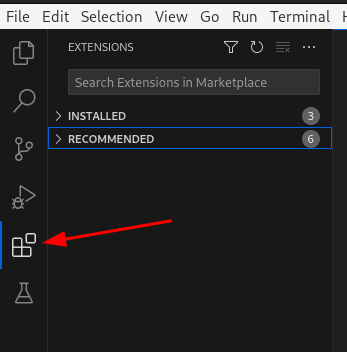
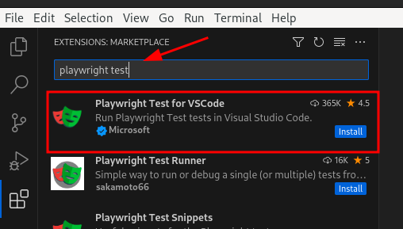
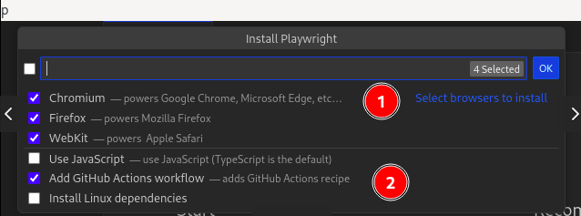
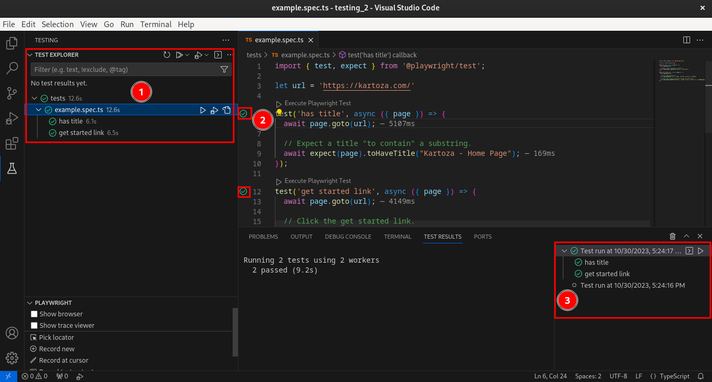

# End-to-end testing

## Intro
[E2E](https://www.techtarget.com/searchsoftwarequality/definition/End-to-end-testing)
verifies working order of a system from start to end taking into account real world scenarios the system can run(simulate user experience)

There are of two types:
- Horizontal - confirms whether a user can work through the system
- Vertical - testing in layers

White box testing and black box testing [here]( https://youtu.be/ucmIS3z7mqc?si=ybvtlr_0yVqDZQ4K)

Most of the projects of the applications at the company are mainly in Django with a React frontend.

To accomplish E2E testing, we use [playwright](https://playwright.dev/).
It supports all the major browsers used today.

## Getting started

To get started with Playwright, you need to ensure you have playwright installed in your device locally.
There are a variety of playwright packages, but as per our standards we will use Playwright Nodejs package.

### Installing nodejs

To set up Nodejs in Debian/Ubuntu or Fedora, the binary distributions for Nodejs are available at [Nodesource](https://github.com/nodesource/distributions).
The binary setups are directly installed.

For NixOS, the configuration can be found at [NixOS packages](https://search.nixos.org/packages).
You can go ahead and search for the Nodejs version best suited.
The configuration for that package is then added to `etc/nixos/configuration.nix`.
```nixos
environment.systemPackages = [
    pkgs.nodejs_18
  ];
```

### Installing playwright using npm

At the root of your project directory `Project`, create a directory called `Project/playwright`.

To install playwright locally use:
```bash
npm init playwright@latest
```

To configure it step by step:

To install all browsers and all its dependencies:
```bash
npx playwright install --with-deps
```

To install and one browser and its dependencies
```bash
npx playwright install chromium --with-deps
```

**For Continuous Integration(`CI`):**

To update npm dependencies
```bash
npm install
```

To install CI dependencies
```bash
npm ci
```

To install playwright package, its browsers and linux dependencies
```bash
npx playwright install --with-deps
```

To run tests:

```bash
npx playwright test
```

### Alternative: playwright in visual studio code

Install extension `Playwright extention`

Click on the vscode's extension icon:



Search for `playwright test`, select the below playwright test extension:


Install the extension:


On your keyboard, press `ctrl + shift + P`.
Search for `playwright`, select `Install Playwright`.


It will open up the following menu:


For option `1`: You can choose to install one or all the browsers.

For option `2`:
- Use `TypeScript` as a default(current preferred standard).
- You can enable to add `GitHub actions` if the tests are for `CI`.
- Enable to `Install Linux dependencies` if you are on Debian/Ubuntu.
You can check this option if you are installing playwright for the first time.

Press `Ok` to proceed:
It will install and setup the project.


#### Running playwright tests in vscode
To run tests in vscode click on this testing icon:


It will scan your `tests` directory for playwright tests.


To run click on the triangle icon:


- `1`: Lists down all tests functions. You can tests normally and also debug from here.
- `2`: You can run the test functions from here.
- `3`: Shows the test results for each session.

The tests will run and the results shown.

For more information, look at the [playwright docs for vscode](https://playwright.dev/docs/getting-started-vscode).
