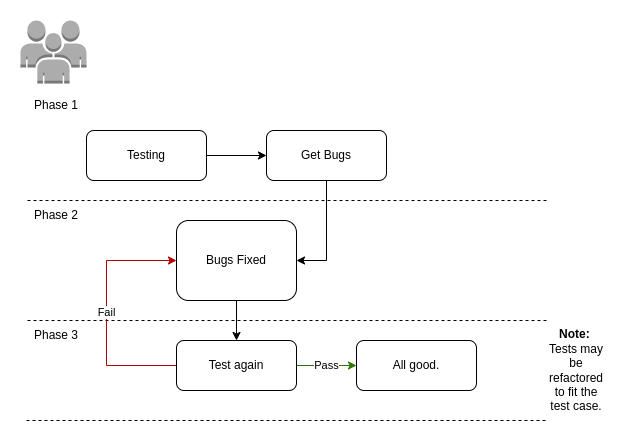

# Regression testing

Regression testing is a type of testing after a code update to ensure that the code did not introduce new bugs.

This means that a testing suite needs to exist prior to conducting regression tests.

Regression testing logic:

Regression tests can be done in various approaches:

- CI/CD tests
- Functional and TDD tests
- End-to-end tests

## Regression tests in CI/CD
In CI/CD, regression tests can be set up in GitHub actions.
This is implemented by structuring the workflow in `.github/workflows/*.yml` file.

The CI pipeline is where automatic tests are triggered by code commit or a pull request to the main branch.
This ensures a faster testing approach.

The approach:

- Build the containers and set up the project
- Test various aspects of the software
- If all checks pass, the changes are open to being merged to the main branch.

## Functional and TDD tests

This is another way to conduct regression tests.
This approach can be implemented using various software testing techniques.
Examples are:

- [Test-Driven Development](./tdd.md)
- [Functional testing](./functionaltesting.md)

## End-to-end tests

Recording tests can be done using [playwright](https://playwright.dev/).
Playwright allows one to be able to record their workflow step by step then generates a script.
You can run the script after each new deployment to staging/production.

All checks are expected to pass, unless there is a major workflow change.
This method comes in handy when testing if a bug has been fixed.

For more information, look at [end-to-end-testing](./end2endtesting.md#for-staging-tests).
